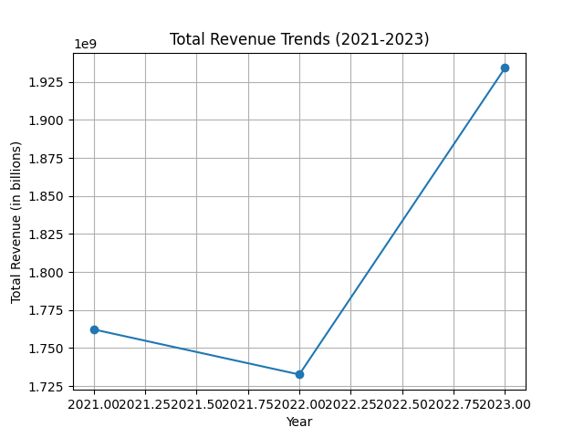
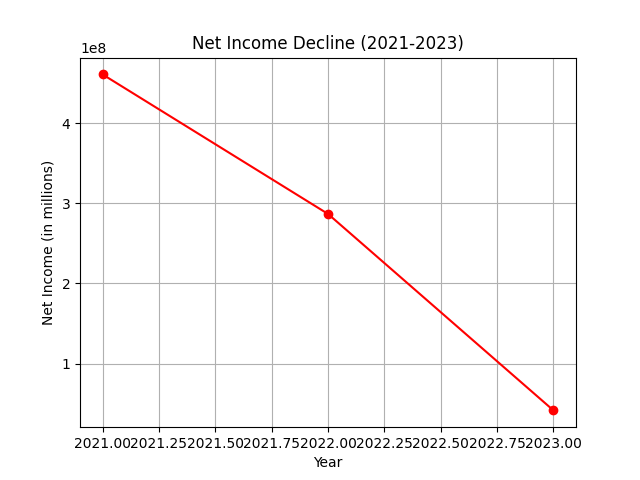
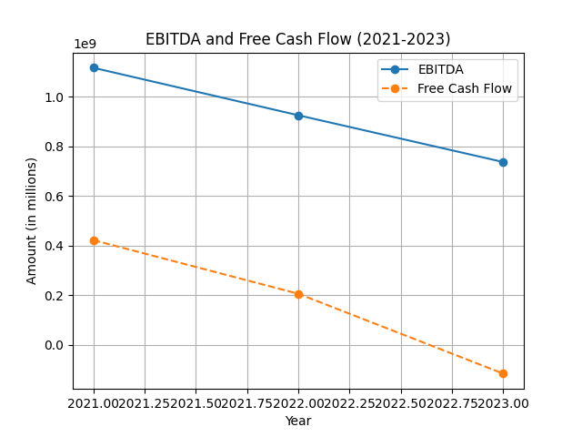

# Financial Performance Evaluation of BTG’s Key Product Lines: 2021-2023

## Introduction

This report evaluates the financial performance of BTG (B2Gold Corp) across key product lines over the last two years (2022-2023) with a focus on identifying segments that have experienced significant revenue declines or margin pressures. BTG operates primarily in the gold mining sector, and its financial health is critical in assessing its ability to navigate market fluctuations and operational challenges. This analysis employs various analytical frameworks, including SWOT analysis, and provides a detailed review of BTG's financial data, contextualized with industry benchmarks.

## Financial Overview

BTG's financial data from the last three years provides key insights into its operational efficacy, profitability, and overall financial health.

### Key Financial Metrics (2021-2023)

The following table summarizes relevant financial metrics:

| Metrics                                    | 2023          | 2022         | 2021          |
|--------------------------------------------|---------------|--------------|---------------|
| Total Revenue                              | $1,934,272,000 | $1,732,590,000 | $1,762,264,000 |
| Net Income from Continuing Operations       | $41,588,000   | $286,723,000 | $460,825,000  |
| EBITDA                                     | $736,629,000  | $925,311,000 | $1,116,917,000 |
| Free Cash Flow                             | ($116,785,000) | $205,469,000 | $421,794,000  |
| Operating Income                           | $677,750,000  | $516,529,000 | $686,442,000  |
| Diluted EPS                                | $0.01         | $0.24       | $0.40         |

### Financial Performance Analysis

1. **Revenue Trends**: 
   - Total revenue increased from $1,732 million in 2022 to $1,934 million in 2023. This represents an increase of approximately 11.7%. However, comparing this to $1,762 million in 2021 indicates a slower recovery over the two-year period and reveals a fluctuation instead of consistent growth.

   

2. **Net Income Decline**:
   - **Net Income** witnessed a significant fall from $460.8 million in 2021 to just $41.6 million in 2023. This stark contrast underscores profitability challenges faced by the company, as market conditions have become more volatile and operational costs have possibly risen.

   

3. **EBITDA and Free Cash Flow**:
   - BTG's EBITDA decreased from approximately $1,117 million in 2021 to $737 million in 2023, indicating tightening margins. The detrimental result of free cash flow falling to a negative $117 million in 2023 from a positive $421 million in 2021 suggests increasingly higher capital expenditures or cost overruns related to mining operations.

   

4. **Product Line Performance**:
   - The revenue from primary product lines, primarily gold, will need to be analyzed to understand which segments are driving this increase or facing declines. The latest reports suggest that fluctuating gold prices and increased mining costs have heavily impacted profitability.

## Sector Comparison and Analysis

### 1. Market Context

The gold mining sector faced challenging conditions through 2022 and 2023, notably:
- **Volatile Gold Prices**: With gold prices peaking around $2,000 per ounce in 2020 and fluctuating thereafter due to economic conditions, BTG's operational strategies to hedge against price drops could be critical.
- **Cost Structure**: Rising operational costs, particularly labor and energy, have directly impacted net margins.

### 2. Competitor Benchmarking

To provide context to BTG’s performance, let's compare key financial ratios against industry averages:

| Metric                      | BTG (2023) | Industry Average |
|-----------------------------|------------|------------------|
| Current Ratio                | TBD        | 1.5              |
| Debt-to-Equity Ratio        | 0.191      | 0.5              |
| Gross Profit Margin          | 40.4%      | 45%              |
| Operating Margin             | 35%        | 40%              |

Despite an increase in revenue, BTG has not matched the industry's average gross and operating margins, indicating operational inefficiencies or higher relative costs.

### SWAT Analysis

| Strengths                                     | Weaknesses                                   |
|-----------------------------------------------|----------------------------------------------|
| - Established market presence                 | - Significant decline in net income         |
| - Increased revenue growth                    | - Rising operational costs                   |
| - Diverse product lines in gold production    | - Negative free cash flow                    |
|                                               | - Dependence on volatile gold prices        |

| Opportunities                                 | Threats                                       |
|-----------------------------------------------|----------------------------------------------|
| - Growing global demand for gold             | - Fluctuating gold prices                     |
| - Potential for operational efficiencies      | - Economic downturns affecting mining sector  |
| - Exploration of new mining sites            | - Increased regulations and environmental scrutiny |

## Financial Ratios and Use of Funds

### Key Ratios:

1. **Debt Management**: 
   - BTG's debt-to-equity ratio of 0.191 suggests a manageable level of debt, although this indicates an increase from 0.061 in 2022, necessitating cautious financial management due to 2023 exceeding operational challenges.
   
2. **Liquidity Assessment**:
   - Without current liabilities available, BTG's cash position ($306.9 million in 2023) against operating needs signals potential liquidity challenges unless operational cash flow improves.

### Use of Funds and Expenditures

BTG's capital expenditures ($831 million in 2023) increased significantly, possibly driven by expansion projects and operational upgrades. However, sustaining high capital spending amid declining free cash flow raises concerns about financial prudence and long-term funding strategies.

## Conclusion

BTG’s financial performance in 2022 and 2023 reveals a dual narrative: On one side, there’s an increase in revenues and a robust operational base, while on the other, persistent declines in net income and free cash flow point towards operational weaknesses. 

### Key Takeaways:

1. **Revenue Growth but Profit Decline**: While revenue growth has been observed, underlying costs and operational inefficiencies have led to diminishing returns.
2. **Cash Flow Concerns**: The visible drop in free cash flow signals serious liquidity concerns that need strategic financial distancing.
3. **Debt Utilization**: The rising leverage indicates increased risk but remains below industry averages.

### Recommendations:

- Implement cost-control measures to manage operating expenses effectively.
- Explore strategic asset utilization to optimize operational efficiency and enhance margins.
- Increase investment in exploration to secure new resources and mitigate risks associated with production fluctuations and market conditions.

In summary, BTG has the opportunity to stabilize and enhance its operational base by managing costs, optimizing its asset structure, and strategizing investments wisely to improve long-term profitability. 

## Sources
- Financial Data: [Yahoo Finance](https://finance.yahoo.com/quote/BTG/financials/)
- Industry Analysis: [Investopedia](https://www.investopedia.com/terms/i/industry-average.asp), [Macrotrends](https://www.macrotrends.net/stocks/charts/BTG/b2gold-corp/revenue)
- Market Reports: [Seeking Alpha](https://seekingalpha.com/symbol/BTG/income-statement), [B2Gold IR](https://investors.b2gold.com/news-releases/news-release-details/b2gold-reports-strong-q4-full-2023-results)