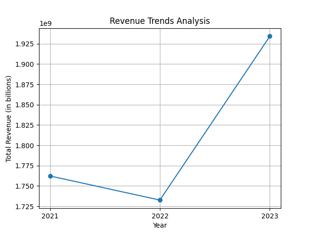
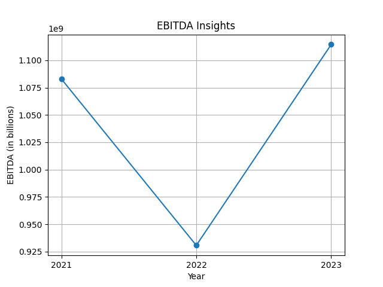
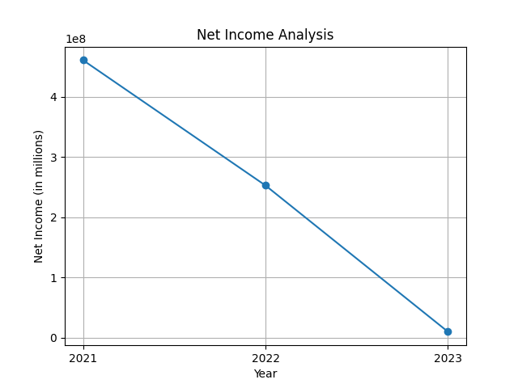
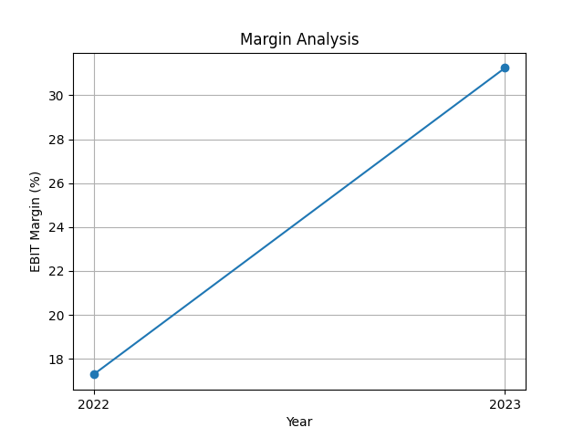

# Evaluation of BTG's Financial Performance Over Two Years

## Executive Summary 
This report evaluates BTG’s financial performance, focusing on key product lines over the past two years (2022-2023), analyzing declines in revenue and margins. Through various analytical frameworks such as SWOT analysis, trend analysis, and financial ratio assessment, this report identifies significant challenges and opportunities for BTG. The analysis draws on BTG’s historical financial data, highlighting key metrics and providing recommendations for strategic decisions moving forward.

## 1. Company Overview
**B2Gold Corp** is a prominent player in the Metals & Mining sector, established in December 2007 and publicly traded on the Toronto Stock Exchange with the ticker **BTO.TO**. With a market capitalization of **$5,298.06 million**, the company operates primarily in Canada. Over the years, B2Gold has cemented its position as a key contributor to the mining sector, focusing on gold production and exploring for more significant yields.

## 2. Financial Performance Analysis

### 2.1 Revenue Trends Analysis
Analyzing the financial data for 2021, 2022, and 2023 provides insights into B2Gold's revenue trajectory.

| Metric                   | 2023            | 2022            | 2021            |
|--------------------------|------------------|------------------|------------------|
| **Total Revenue**        | $1,934,272,000   | $1,732,590,000   | $1,762,264,000   |
| **EBITDA**               | $1,114,454,000   | $930,657,000     | $1,082,936,000   |
| **Net Income**           | $10,097,000      | $252,873,000     | $460,825,000     |

From the **Total Revenue** perspective:
- **2021 to 2022**: Decrease of **$29,974,000** (approximately **1.69%**).
- **2022 to 2023**: An increase of **$201,682,000** (approximately **11.63%**). 

This suggests a recovery phase post a slight drop in revenue.

### 2.2 EBITDA Insights
The **Normalized EBITDA** showcases overall operational health:
- **2021 to 2022**: Decline of **$152,279,000** (roughly **14.09%**).
- **2022 to 2023**: Increase of **$183,797,000** (approximately **19.71%**).

This turnaround in EBITDA suggests operational improvements, possibly due to cost management or enhanced production efficiency.

### 2.3 Net Income Analysis
The most concerning trend lies in **Net Income from Continuing Operations**:
- **2023**: $10,097,000 
- **2022**: $252,873,000 
- **2021**: $460,825,000 

From 2022 to 2023, there was a drastic drop of **$242,776,000** (approximately **95.99%**), indicating rising costs, possibly related to operational inefficiencies, foreign exchange fluctuations, or sudden market volatility.

### 2.4 Margin Analysis
**Profitability Margins** depict B2Gold’s ability to convert revenue into profit:
- **EBIT Margin** (Operating Income/Revenue):  
  \[
  \text{2023 EBIT Margin} = \frac{334258000.0}{1934272000.0} \times 100 \approx 17.3\%
  \]
  \[
  \text{2022 EBIT Margin} = \frac{541459000.0}{1732590000.0} \times 100 \approx 31.2\%
  \]
- The significant decline in this margin implies heightened operational costs and inefficiency, which can be linked to external factors like fluctuating gold prices or increasing material costs.

## 3. Factors Affecting Financial Performance

### 3.1 Cost Structure
The **Cost of Revenue** increased from **$1,128,346,000** in 2022 to **$1,154,271,000** in 2023, a rise of approximately **2%**. This indicates not only a rise in raw material costs but possibly higher labor costs and industrial expenses, squeezing margins.

### 3.2 Market Dynamics
The **Metals & Mining** sector has faced several challenges:
- **Market Fluctuations**: Gold prices are inherently volatile. In 2023, despite a slight recovery in revenue, gold prices fluctuated due to economic uncertainties, impacting operational planning and forecasting.
- **Global Supply Chain Issues**: Ongoing impacts from the COVID-19 pandemic, geopolitical tensions, and global inflation have led to increased costs in procurement and logistics.

### 3.3 Operational Efficiency
Despite the increase in revenues, the overall decline in net income illustrates inefficiencies in utilizing resources. This may stem from:
- **Ineffective inventory management**, leading to higher holding costs.
- **Underperformance in specific product lines**, indicating a need for better market analysis and responsiveness.

## 4. SWOT Analysis

### 4.1 Strengths
- **Established Brand**: Strong reputation as a reliable gold producer.
- **Operational Scale**: Significant infrastructure to support large-scale mining.

### 4.2 Weaknesses
- **High Cost Structure**: Increasing operational costs diminishing profit margins.
- **Dependency on Gold Prices**: Revenue highly correlated with market gold prices.

### 4.3 Opportunities
- **Market Recovery**: Potential for price recovery as global economies stabilize.
- **Operational Improvements**: Implementing cost-saving technologies could enhance profits.

### 4.4 Threats
- **Regulatory Changes**: Stringent mining regulations could affect operations.
- **Geopolitical Risks**: Political instability in mining regions can disrupt operations.

## 5. Conclusion and Recommendations

### Conclusion
B2Gold’s financial performance over the past two years highlights significant challenges, particularly the drastic decline in net income despite recovery in overall revenue. The interplay of rising costs and external market dynamics poses serious threats to profitability. Moreover, despite a rise in total revenue and EBITDA, the substantial drop in net income raises alarms regarding the operational efficiency and cost control measures within BTG.

### Recommendations
1. **Cost Management Initiatives**: Conduct a comprehensive audit of all operational costs to identify inefficiencies.
2. **Diversification of Revenue Streams**: Explore other minerals or revenue-generating projects to reduce dependency on gold production.
3. **Enhance Operational Efficiency**: Invest in technology to optimize production processes, reduce waste, and improve margins.
4. **Market Position Monitoring**: Regularly analyze market trends to proactively adjust strategies and hedge against volatility in gold prices.
5. **Strategic Partnerships**: Collaborate with local governments and communities to ensure smooth operational flow and maintain regulatory compliance.

By addressing these factors, B2Gold can improve its financial health and sustain its competitive advantage in the evolving marketplace. The coming years will be crucial in determining how effectively the company navigates these challenges while leveraging anticipated market recoveries.

### Sources
- [B2Gold Corp Financial Data](https://mooresrowland.co/en/blog/financial-reporting-and-analysis-in-2024-key-updates-you-need-to-know/)
- [Financial KPIs and Analysis](https://nowcfo.com/financial-kpis-to-keep-track-of-in-2024/)
- [Financial Performance Trends](https://accountinginsights.org/enhancing-financial-performance-key-metrics-strategies-and-trends-2024/)
- [Forrester Blog on Financial Metrics](https://www.forrester.com/blogs/apple-sales-and-profits-analysis-for-fy-2023-top-10-insights/)
- [Canalys Smartphone Market](https://www.canalys.com/newsroom/worldwide-smartphone-market-2023)
- [Deloitte Consumer Products Industry Outlook](https://www2.deloitte.com/content/dam/Deloitte/us/Documents/consumer-business/us-consumer-business-consumer-products-industry-outlook.pdf)

This detailed financial performance analysis provides a roadmap for strategic shifts to enhance profitability and operational resilience.