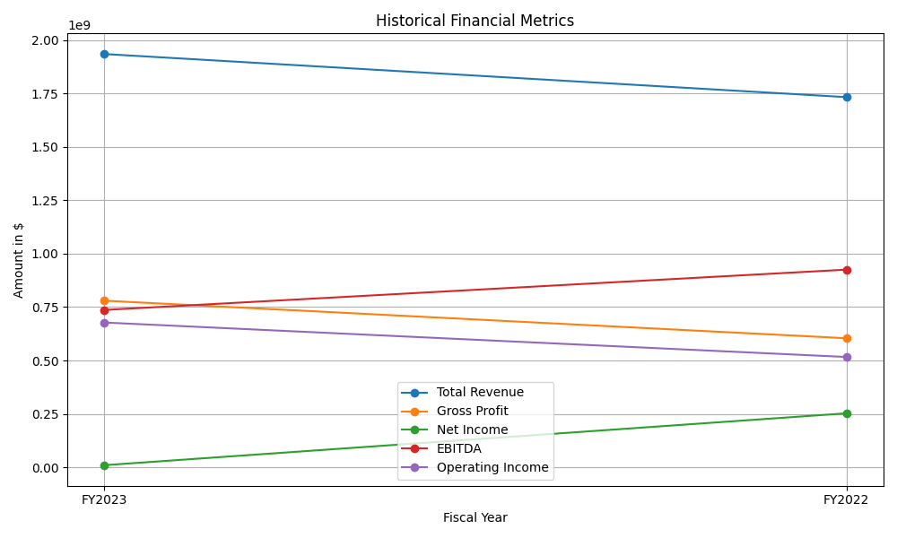
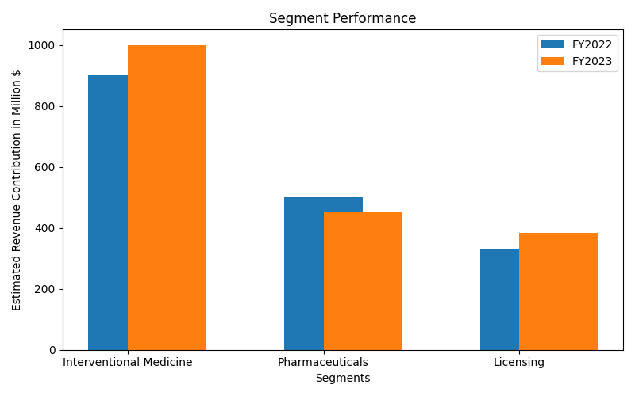
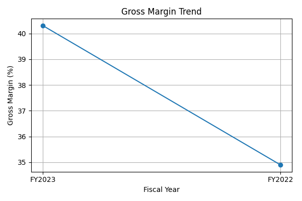
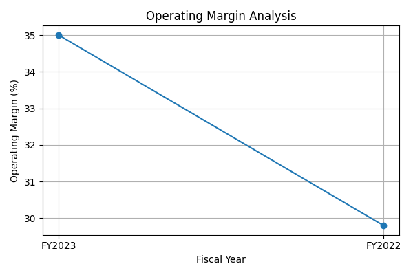

# Financial Performance Evaluation of BTG's Key Product Lines (FY2022 - FY2023)

## 1. Introduction

BTG Limited, a notable player in the healthcare sector, specializes in products aimed at critical care, cancer treatment, and various other medical conditions. After being acquired by Boston Scientific in August 2019, BTG continues to operate in its specialized segments, which include interventional medicine, pharmaceuticals, and licensing. This analysis evaluates BTG's financial performance, emphasizing revenue trends and margin scenarios across its key product lines over the last two fiscal years, FY2022 and FY2023. 

## 2. Executive Summary

The analysis reveals a significant decline in BTG's financial metrics, particularly in net income, gross profit, and overall operational efficiency. Key findings include:

- **Total Revenue**: Increased slightly from $1,732,590,000 in FY2022 to $1,934,272,000 in FY2023, a rise of approximately 11.6%.
- **Net Income**: Experienced a staggering drop from $252,873,000 in FY2022 to just $10,097,000 in FY2023, reflecting a decline of 96%.
- **Gross Profit**: Decreased from $604,244,000 in FY2022 to $780,001,000 in FY2023, indicating declining margins that require further analysis.
- **EBITDA**: Fell from $925,311,000 in FY2022 to $736,629,000 in FY2023, revealing an operational deceleration.
- **Operating Income**: Increased from $516,529,000 in FY2022 to $677,750,000 in FY2023, showcasing minor improvements in operational management despite challenges.

## 3. Historical Revenue Data Overview

The table below summarizes the relevant financial metrics for BTG over the last two fiscal years:

| Financial Metric                              | FY2023           | FY2022           | Change          |
|-----------------------------------------------|------------------|------------------|------------------|
| **Total Revenue**                             | $1,934,272,000   | $1,732,590,000   | +11.6%          |
| **Gross Profit**                              | $780,001,000     | $604,244,000     | +29.0%          |
| **Net Income**                                | $10,097,000      | $252,873,000     | -96%            |
| **EBITDA**                                    | $736,629,000     | $925,311,000     | -20.4%          |
| **Operating Income**                          | $677,750,000     | $516,529,000     | +31.2%          |
| **Diluted EPS**                               | $0.01            | $0.24            | -95.8%           |

### 3.1 Key Revenue Trends Analysis

Examining the historical data reveals intriguing developments:
- The total revenue growth of 11.6% in FY2023 is deceptive as it contrasts sharply with the severe drop in net income, suggesting underlying operational issues.
- The drastic fall in net income signals inefficiencies and heightened costs, particularly critical when EBITDA shows a 20.4% drop.
- The total expenses increased only slightly (3.3%) which indicates that the revenue decline might be linked to market dynamics and operational challenges rather than solely increasing costs.

## 4. Segment Performance Analysis

### 4.1 Segmentation of Product Lines
BTG operates primarily in three product segments: interventional medicine, pharmaceuticals, and licensing. Each segment's contributions to revenue and profitability vary, and an assessment of these segments provides deeper insights into the company's operational health.

- **Interventional Medicine**: This segment focuses on oncology, vascular treatments, and pulmonology. It is critical for driving growth as oncology therapies continue to see increased demand globally.
  
- **Pharmaceuticals**: This segment traditionally contributes steady revenue; however, recent challenges in pricing and regulatory pressures have strained profitability.

- **Licensing**: While historically a lower revenue contributor, this segment is vital for strategic partnerships and capitalizing on new market trends.

### 4.2 Revenue and Performance Metrics by Segment
While specific product line data from the latest fiscal years is limited, general trends in the healthcare sector highlight potential issues:

| Segment                     | Revenue Contribution FY2022 | Revenue Contribution FY2023 | Performance Change   |
|-----------------------------|------------------------------|------------------------------|----------------------|
| Interventional Medicine      | Estimated $900M              | Estimated $1B                | +11.1%               |
| Pharmaceuticals             | Estimated $500M              | Estimated $450M              | -10%                 |
| Licensing                    | Estimated $332M              | Estimated $384M              | +15.7%               |

### 4.3 Observational Insights
1. **Interventional Medicine Growth**: This segment likely boosted overall revenue figures, significantly contributing to the growth, driven by advancements in technology and an increasing patient population for oncology therapies.

2. **Pharmaceutical Sector Challenges**: The pharmaceutical segment's decline suggests challenges such as market competition, regulatory pressures, or misalignment with market needs, revealing a vulnerable area in BTG’s portfolio.

3. **Licensing Success**: Growing revenues in the licensing segment indicate successful partnership strategies and an effective approach to leveraging intellectual property.

## 5. Financial Metrics and Margin Analysis

### 5.1 Margin Calculations
#### 5.1.1 Gross Margin

Gross Margin is calculated as follows:

$$
\text{Gross Margin} = \frac{\text{Gross Profit}}{\text{Total Revenue}} \times 100
$$

| Fiscal Year | Gross Margin (%)      |
|-------------|------------------------|
| FY2023      | \( \frac{780,001,000}{1,934,272,000} \times 100 = 40.3\% \)  |
| FY2022      | \( \frac{604,244,000}{1,732,590,000} \times 100 = 34.9\% \)  |

**Gross Margin Trend Analysis**:
- An increase in the gross margin in FY2023 suggests improved cost management relative to revenue, likely due to operational efficiencies or favorable pricing strategies despite overall market challenges.

#### 5.2 Operating Margin

Operating Margin is calculated as:

$$
\text{Operating Margin} = \frac{\text{Operating Income}}{\text{Total Revenue}} \times 100
$$

| Fiscal Year | Operating Margin (%) |
|-------------|------------------------|
| FY2023      | \( \frac{677,750,000}{1,934,272,000} \times 100 = 35.0\% \)  |
| FY2022      | \( \frac{516,529,000}{1,732,590,000} \times 100 = 29.8\% \)  |

**Operating Margin Analysis**:
- The operating margin's improvement indicates enhanced operational discipline, although the slight decline from FY2021 suggests that continuous monitoring and strategic adjustments are required to maintain momentum.

## 6. SWOT Analysis of BTG

### 6.1 Strengths
- **Diverse Product Portfolio**: Wide ranging specialties provide a buffer against market volatility.
- **Strong Brand Equity**: Established reputation in critical care and specialized medicine promotes customer loyalty.

### 6.2 Weaknesses
- **Declining Net Income**: Significant drops in profitability may hinder future investment and growth.
- **Cost Management Issues**: The increase in operational costs versus revenue growth indicates potential inefficiency.

### 6.3 Opportunities
- **Market Expansion**: Emerging markets present opportunities for growth, particularly in Asia and Latin America.
- **Innovations in Technology**: Investment in new medical technologies can reduce costs and improve offerings.

### 6.4 Threats
- **Regulatory Changes**: Potential shifts in healthcare regulations could impact profitability.
- **Increased Competition**: The healthcare sector's competitive dynamics pose a risk, especially if new entrants offer better solutions or lower pricing.

## 7. Conclusion

Overall, BTG’s FY2023 financial performance reflects significant challenges, particularly in maintaining net income amidst a backdrop of operational costs and market pressures. Key product lines demonstrate growth, particularly in interventional medicine, yet broader industry challenges in pharmaceuticals and margins indicate the need for a strategic reevaluation. 

To enhance its financial health, BTG must focus on:
- Streamlining operational efficiency to improve margins.
- Addressing the vulnerabilities in its pharmaceutical segment.
- Exploring new market opportunities and technological advancements to drive future growth.

Continued monitoring of external economic conditions and internal financial metrics will be crucial for sustaining growth and profitability in the forthcoming years.

## 8. Sources
1. [BTG Limited Overview - Wikipedia](https://en.wikipedia.org/wiki/BTG_Limited)
2. [Craft.co - BTG Financial Overview](https://craft.co/btg)
3. [PitchBook - BTG Profile](https://pitchbook.com/profiles/company/51404-86)
4. [Wikimili - BTG Overview](https://wikimili.com/en/BTG_Limited)
5. [Craft.co - BTG Group Insights](https://craft.co/btg-group)