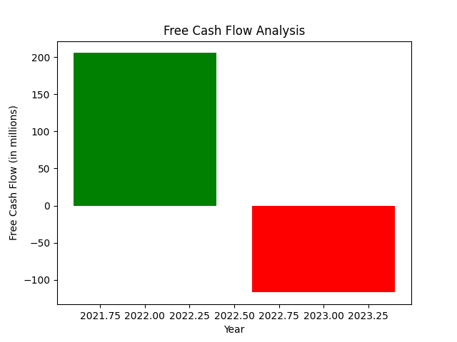
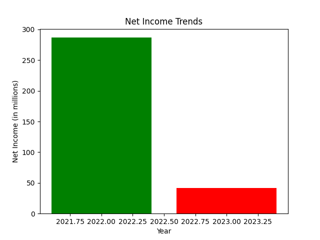
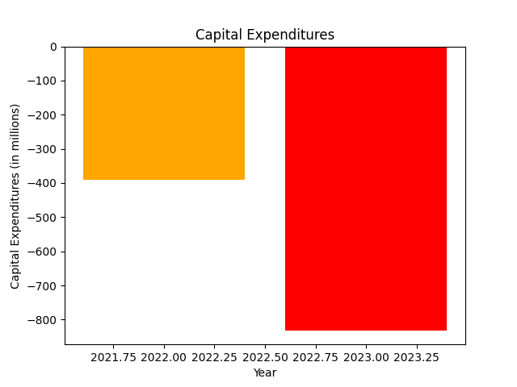
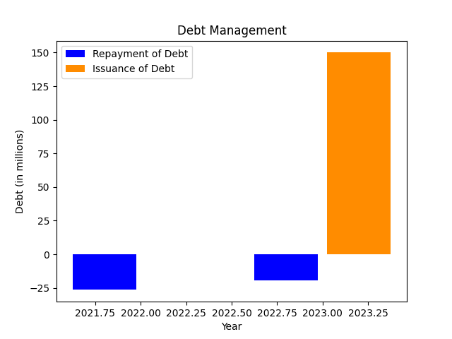
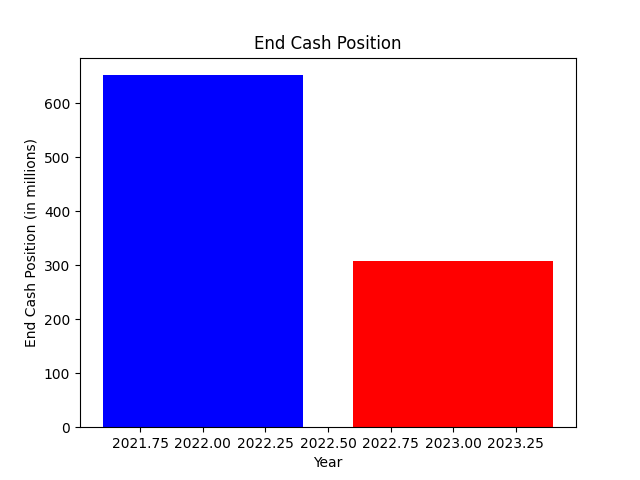

# Comprehensive Financial Analysis of B2Gold Corp (BTG) 

## Introduction

B2Gold Corp, incorporated on December 3, 2007, has established itself as a major player in the Metals & Mining sector, primarily focusing on gold production. Trading under the ticker symbol BTO.TO on the Toronto Stock Exchange, B2Gold has a market capitalization of approximately $5.30 billion with 1.31 billion shares outstanding as of December 2024. The company operates globally, including significant interests in various gold mining projects across regions such as Mali, the Philippines, and Colombia, highlighting its strategic commitment to diversifying its production portfolio. This report presents a detailed financial performance analysis of BTG's key product lines over the last two years, focusing on revenue generation, profitability, capital allocation, and the financial health of the organization.

## Financial Overview

The core of B2Gold's financial analysis centers around critical metrics derived from its income statement and balance sheet from the past two years (2023 and 2022). The analysis includes free cash flow, net income, capital expenditures, debt management, and liquidity. The following sections provide a comprehensive review of these metrics to ascertain the financial trends and challenges faced by the organization.

### Free Cash Flow Analysis

Free cash flow (FCF) is pivotal in evaluating a company's cash generation ability post capital expenditures. The following table summarizes BTG's free cash flow over the last two years:

| Year       | Free Cash Flow (in millions) |
|------------|-------------------------------|
| 2023       | -$116.79                      |
| 2022       | $205.47                       |

**Observation**: BTG's free cash flow turned negative in 2023 at -$116.79 million, a stark decline from a positive $205.47 million in 2022. This dramatic shift suggests underlying cash management issues, potentially due to decreased operational efficiency or increased capital spending. The negative FCF indicates that B2Gold faced challenges generating sufficient cash to meet its capital expenditures and operating needs, thus raising concerns about its liquidity and operational viability.

### Net Income Trends

Net income from continuing operations serves as an essential performance yardstick. The summary of BTG's net income reveals the following:

| Year       | Net Income (in millions) |
|------------|--------------------------|
| 2023       | $41.59                   |
| 2022       | $286.72                  |

**Observation**: The substantial decrease in net income from $286.72 million in 2022 to $41.59 million in 2023 reflects a steep decline of approximately 85%. Such a decline raises red flags regarding profitability, possibly stemming from increased production costs, lower gold prices, or operational inefficiencies. A detailed review of cost structures and market conditions will be essential to understand the drivers behind this contraction.

### Capital Expenditures

Capital expenditures (CapEx) are integral to investment strategies and growth. The following highlights BTG's CapEx in the past two years:

| Year       | Capital Expenditures (in millions) |
|------------|------------------------------------|
| 2023       | -$831.24                           |
| 2022       | -$390.33                           |

**Observation**: B2Gold's capital expenditures surged from $390.33 million in 2022 to $831.24 million in 2023, indicating an aggressive investment strategy likely aimed at expanding production capacity and enhancing operational efficiency. However, the substantial rise in CapEx alongside declining cash flow and profits reveals a potentially risky strategy, placing short-term financial health at risk for prospective long-term gains.

### Debt Management

Effective debt management plays a crucial role in preserving financial stability. The table below summarizes BTG's debt activities:

| Year       | Repayment of Debt (in millions) | Issuance of Debt (in millions) |
|------------|----------------------------------|---------------------------------|
| 2023       | -$19.49                          | $150.00                         |
| 2022       | -$26.42                          | $0.00                           |

**Observation**: In 2023, BTG issued $150 million of new debt while reducing its repayment amount to $19.49 million. This indicates that the company is actively seeking to leverage debt to bolster liquidity, finance its CapEx, and sustain operations, especially amid declining profits. While leveraging can provide immediate cash flow relief, it exposes the company to increased financial risk if cash flows do not stabilize or improve, especially given the current negative FCF.

### Overall Financial Health

The end cash position is critical in assessing liquidity and operational capabilities. The following table illustrates BTG’s end cash position:

| Year       | End Cash Position (in millions) |
|------------|----------------------------------|
| 2023       | $306.90                          |
| 2022       | $651.95                          |

**Observation**: The drastic decline in the end cash position from $651.95 million in 2022 to $306.90 million in 2023 signals diminishing liquidity. This reduction can adversely affect BTG's ability to navigate market fluctuations, invest in future projects, or manage operating setbacks effectively. A financial strategy focusing on immediate liquidity enhancement may be warranted to address this potential instability.

## Segment Analysis

B2Gold's product lines include various gold mining operations, each contributing differently to revenue and profitability. To evaluate segment performance accurately, we employ the SWOT analysis for its key subsidiaries.

### SWOT Analysis of B2Gold

#### Strengths
- **Diverse Geographic Portfolio**: B2Gold operates in multiple favorable mining jurisdictions, reducing geopolitical risk.
- **Robust Asset Base**: The company has significant gold reserves, which can facilitate sustained production for years.
- **Strong Industry Relationships**: Established relationships with suppliers and contractors can create advantageous terms and reliability.

#### Weaknesses
- **High Capital Expenditure**: The high level of investment may strain liquidity and impact short-term profits amidst declining prices.
- **Decreasing Profitability**: Recent declines in net income indicate potential management or operational inefficiencies that need addressing.
  
#### Opportunities
- **Rising Gold Prices**: Any rebound in gold prices could significantly enhance profitability, particularly if production costs stabilize.
- **Exploration and Development**: B2Gold can pursue additional mining projects or exploration to tap into new resources.
  
#### Threats
- **Market Volatility**: Fluctuating gold prices can drastically affect revenues and profitability.
- **Operational Risks**: Mining has inherent risks, including accidents, regulatory challenges, and geological uncertainties, which could hinder operations.

## Financial Performance Summary

The financial performance of B2Gold over the past two years presents a concerning outlook characterized by:

1. **Negative Free Cash Flow**: The shift to a negative cash flow position may necessitate restructuring in financial management or operational efficiency.
2. **Plummeting Net Income**: The drastic decline in profitability suggests a pressing need for cost optimization and market adaptability.
3. **Increasing Capital Expenditures**: While investments are essential for long-term growth, the recent surge without corresponding revenue growth raises red flags.
4. **Rising Debt Levels**: Although leveraging debt can provide liquidity, increasing reliance on borrowed funds amidst declining revenues poses a significant risk.

## Conclusion

B2Gold Corp's financial analysis reveals critical challenges impacting its operations and market position in the gold mining industry. The downturn in free cash flow and net income alongside rising capital expenditures and debt suggests a need for strategic reassessment. Moving forward, BTG might focus on rebalancing its capital allocation, enhancing operational efficiencies, and stabilizing its funding strategies to mitigate risks related to debt and ensure financial resilience.

### Key Takeaways & Recommendations:
- **Operational Efficiency**: Undertake a review of operations to identify areas for cost reduction and efficiency improvements. This may include renegotiating supplier contracts or optimizing workforce management.
- **Debt Management**: Re-evaluate current debt levels and financial obligations to determine sustainable financing routes. BTG should also consider opportunities for refinancing at more favorable rates.
- **Market Adaptability**: Develop strategies to hedge against gold price fluctuations, ensuring profitability under varying market conditions. Diversification into other commodity streams could also be considered.
- **Sustainability in Investments**: Align capital expenditures with short-term cash flow capabilities to ensure that the company can maintain liquidity while pursuing growth.

These strategic decisions will be integral to navigating the challenges B2Gold faces, securing its reputation as a key player in the mining sector, and enhancing shareholder value.

## References

- [MarketBeat - B2Gold Corp Financials](https://www.marketbeat.com/stocks/TSE/BTO/earnings/)
- [Yahoo Finance - B2Gold Corp Overview](https://ca.finance.yahoo.com/quote/BTO.TO/)
- [Reuters - B2Gold Corp Quote and Financial Information](https://www.reuters.com/markets/companies/BTO.TO)
- [Yahoo Finance - B2Gold Reports](https://finance.yahoo.com/news/b2gold-btg-reports-y-y-135300709.html)
- [Stock Analysis - B2Gold Financials](https://stockanalysis.com/stocks/btg/financials/)

This comprehensive analysis provides stakeholders with the necessary insights to make informed decisions regarding B2Gold's future strategies and investments in a dynamic market environment.