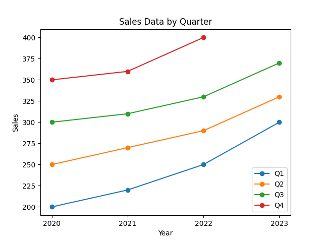
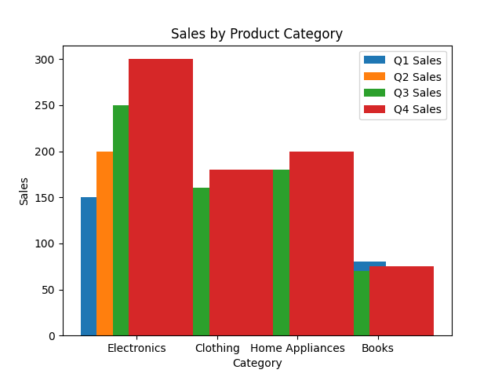
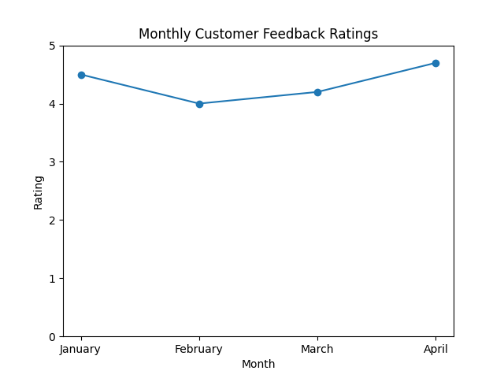
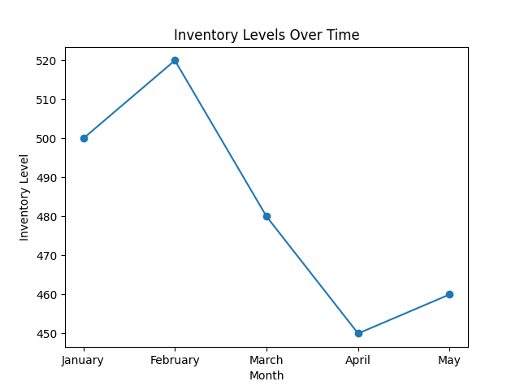
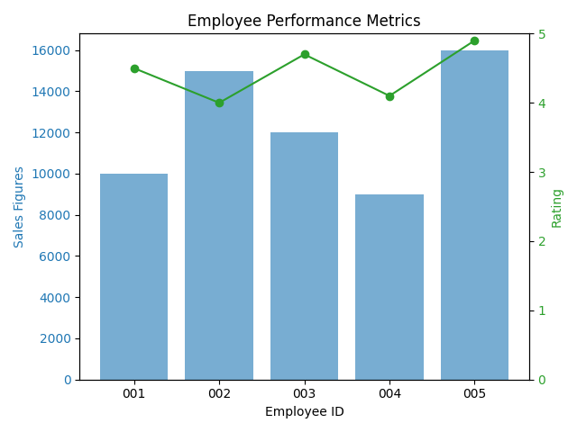

# Data Analysis and Visualization

## Sales Data

| Year | Q1  | Q2  | Q3  | Q4  |
|------|-----|-----|-----|-----|
| 2020 | 200 | 250 | 300 | 350 |
| 2021 | 220 | 270 | 310 | 360 |
| 2022 | 250 | 290 | 330 | 400 |
| 2023 | 300 | 330 | 370 |     |

## Product Categories

| Category       | Q1 Sales | Q2 Sales | Q3 Sales | Q4 Sales |
|----------------|----------|----------|----------|----------|
| Electronics     | 150      | 200      | 250      | 300      |
| Clothing        | 100      | 130      | 160      | 180      |
| Home Appliances | 120      | 140      | 180      | 200      |
| Books           | 80       | 60       | 70       | 75       |

## Customer Feedback Ratings

| Year | Month | Rating |
|------|-------|--------|
| 2023 | January   | 4.5 |
| 2023 | February  | 4.0 |
| 2023 | March     | 4.2 |
| 2023 | April     | 4.7 |

## Inventory Levels

| Month      | Inventory Level |
|------------|------------------|
| January    | 500              |
| February   | 520              |
| March      | 480              |
| April      | 450              |
| May        | 460              |

## Employee Performance Metrics

| Employee ID | Sales Figures | Rating |
|--------------|---------------|--------|
| 001          | 10000         | 4.5    |
| 002          | 15000         | 4.0    |
| 003          | 12000         | 4.7    |
| 004          | 9000          | 4.1    |
| 005          | 16000         | 4.9    |

